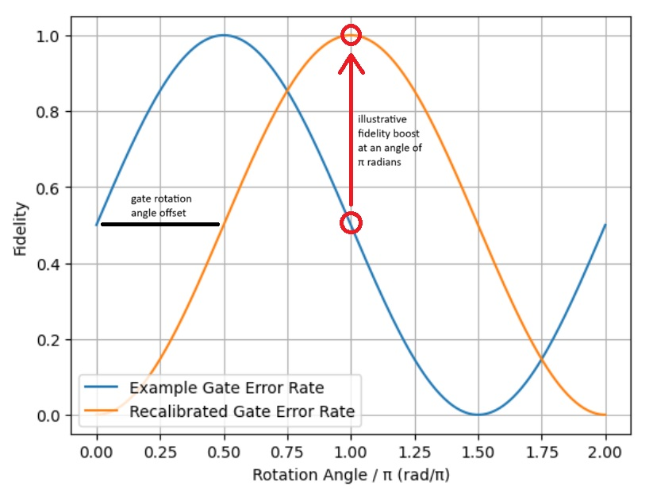
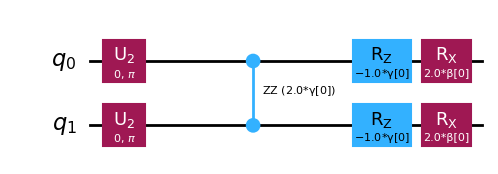
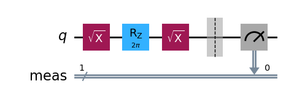
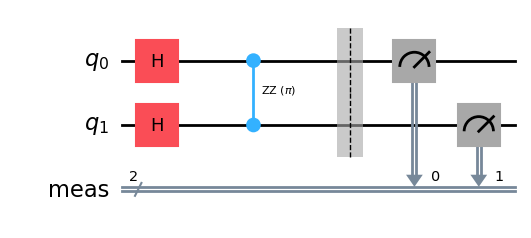
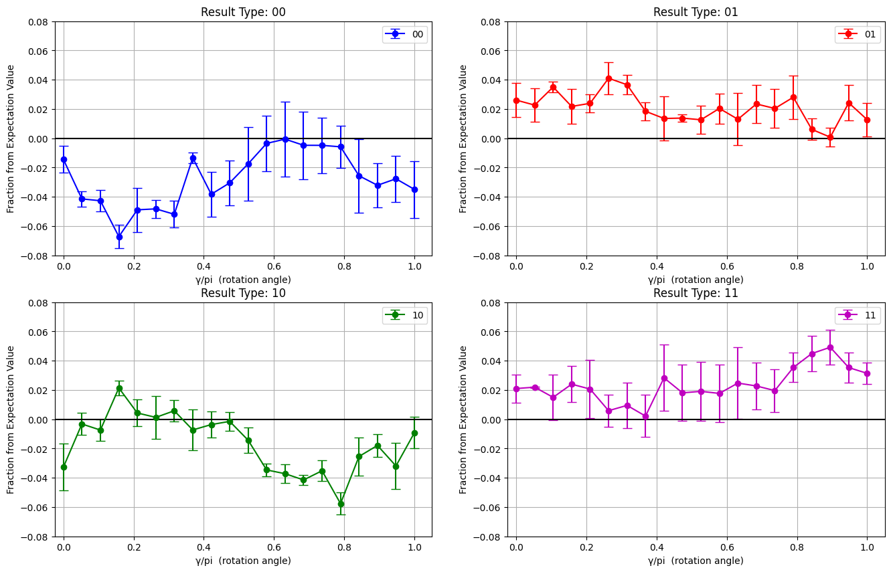
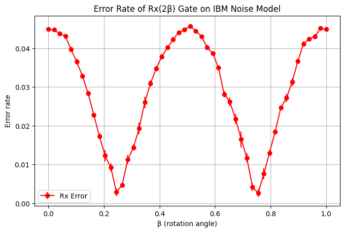

# Investigating Angle-Dependent Errors in Rzz and Rx Gates on IBM Quantum Hardware

**Author:** Rafe Whitehead  
**Date:** April 2025

---

## 1. Overview

This project aims to determine whether the error rates of IBM's `Rzz` and `Rx` gates vary significantly with rotation angle. This is motivated through a possibility of improving performance of the Quantum Approximation Optimisation Algorithm (QAOA), which is constructed of `Rzz` and `Rx` gates, by tuning circuits such that the expected rotations angles of the `Rzz` and `Rx` gates lie within low error domains.

Simple circuits containing a single `Rzz` or `Rx` gate are constructed and evaluated using IBM hardware (for the `Rzz` gate) or IBM simulators loaded with noise models (for the `Rx` gates). This is done for a range of rotation angles and the measured results are compared to anticipated results for each angle to determine a measure of error.

For the `Rx` gate, strong evidence of a sinusodial relationship between rotation angle and error rate of the gate was found. This relationship had a period of 0.5π and a peak to trough drop of 90%. For the `Rz` gate no evidence was found of a relationship between the rotation angle and error rate of the gate. As the error contribution to QAOA from these gates is dominated by the `Rzz` gate contribution, improvements to the `Rx` gate would have negligible effect on the quality of the QAOA results and further investigations on this topic are not recommended.

---

## 2. Background

The QAOA algorithm [\[1\]](#ref-1) holds potential within the Noisy Intermediate Scale Quantum (NISQ) era of quantum computers due to its low required circuit depth and application to combinatorial optimisation problems [\[2\]](#ref-2). This algorithm optimises gate parameters in the quantum circuit by evaluating the circuit repeatedly within a classical optimiser. To reduce the number of optimisation evaluations required, work has been done to determine suitable initial parameters for the quantum circuit, for instance through bilinear strategy, TQA initialisation [\[3\]](#ref-3), or transfer learning [\[4\]](#ref-4).

<!-- Explicit assumption: final angles are near initial ones, should reference something to do with this -->

For hardware implementations, each operation has an associated error attached to it. The accumulation of these errors negatively impacts the quality of the results produced. For QAOA, the gate errors comprise mainly of the `Rzz` and `Rx` gates. If these gates have a relationship between their rotation angle and their error rate, this work proposes the error rate of the circuit could be reduced by constructing gates such that the angles of rotation given in the initialisation strategies (which are expected to be close to the final rotation angles used) lie within the low-error regions of the rotation angle space. This is illustrated in [Figure 1](#fig-0), where a dummy gate error response to the rotation angle is offset to improve the fidelity at a gate rotation angle of π. This gate offset is interpreted as an adjustment to the initial preparation state of the qubits or a different global phase, but the physical interpretation of this change will not be explored further in this paper. Instead, this work only aims to investigate whether a motivation exists for this technique.

  
**Figure 1:** An example of potential gate fidelity improvement at a specific rotation angle. Here, the gate has high fidelity at 0.5π, but transfer learning suggests an initial rotation angle of π. Applying an offset of 0.5π improves fidelity at π.

<!-- In this example, the offset aligns the rotation angle with a region of higher fidelity, as determined by the gate's error profile -->

Hardware implementations leverage error suppression techniques to improve the quality of results produced. IBM offers control over the suppression technique of dynamic decoupling, which uses microwave pulses to reduce decoherence in idling qubits [\[9\]](#ref-9). These pulses may then interact with rotation gates in a way that introduces angle-dependent error rates. However, considering error suppression techniques is beyond the scope of this initial project. Future work could explore these factors.

<!--
The initial parameters can be determined using

The efficacy of this potential approach is dependent upon the existence and strength of a relationship between the error profile of `Rzz` and `Rx` gates and their rotation angle. -->

---

## 3. Methodology

### Hardware

For this investigation, freely-available IBM hardware was used due to its accessibility and record of strong documentation online through the open-source library QISKIT [\[5\]](#ref-5). All devices offered under the free plan have identical specifications. The device `ibm_brisbane` was chosen arbitrarily.

On IBM devices, QAOA algorithms are implemented using layers of `Rx(θ)` and `Rzz(θ)` gates, where a single layer QAOA can be decomposed as shown in [Figure 2](#fig-1) [\[6\]](#ref-6). In this implementation, the error rate is dominated by the 2-qubit `Rzz` gate, with IBM reporting an error rate two orders of magnitude higher for the `Rzz` gate as compared to the `Rx` gate for `ibm_brisbane` [\[7\]](#ref-7). In this investigation, these gates were probed independently for their relationship between fidelity and angle of rotation. Due to the larger contribution of the `Rzz` gate to the overall QAOA circuit error, this gate was investigated using the limited free resources of the `ibm_brisbane` device. The `Rx` gate was investigated using only the IBM simulator provided in QISKIT, loaded with an `ibm_brisbane` noise model.

  
**Figure 2:** A single layer of the IBM implemented QAOA circuit, showing the arrangement of `Rx` and `Rzz` gates.  

### Experimental Setup

The `Rx` and `Rzz` gates were investigated using different circuits and experimental parameters, largely due to hardware limitations under the IBM free programme. A summary of these parameters is given below, and further detail provided in the paragraphs following.

**Experimental Parameters:**

- `Rx` Gate:
  - Device: IBM simulator loaded with `ibm_brisbane` noise model
  - Circuit: [Figure 3](#fig-2)
  - Input: `|0⟩`
  - Shots: 216, repeated 5 times
  - Angles: 50 equally spaced between 0 and π
- `Rzz` Gate:
  - Device: `ibm_brisbane`
  - Circuit: [Figure 4](#fig-3)
  - Input: `|00⟩`
  - Shots: 216, 215, 215 (over 3 dates)
  - Angles: 20 equally spaced between 0 and π

For both gates, the simplest circuit possible was used to minimise the evaluation time, corresponding to the circuits seen in [Figure 3](#fig-2) and [Figure 4](#fig-3). As the `Rx` was investigated using a simulator it was constrained only by the computing power of the local device used, whereas the `Rzz` gate investigation had to be conducted within the 20 minutes of free quantum processing time offered by IBM over the time period this work was carried out. For this reason, the `Rx` gate was investigated at more angles, more shots, and for more repeats than the `Rzz` gate. For both `Rx` and `Rzz` gates the an angle range of \[0 π\] covers the full angle range due to symmetries around 0 and π.

  
**Figure 3:** Circuit used to explore the error profile of the `Rx` gate.  

When the `Rzz` investigation circuit, given in [Figure 4](#fig-3) is evaluated with the input `|00⟩`, the anticipated result, `|φ⟩`, is an equal superposition between all possible output states, given by

|φ⟩ = (1/2) (|00⟩ + |01⟩ + |10⟩ + |11⟩)

this knowledge of the ideal output state was used to determine the error rate of the `Rzz` gate.

<!-- This was done for 20 equally spaced angles between 0 and π, which covers the full angle range of the `Rzz` gate due to symmetries around 0 and π. This was done for 3 separate initialisations of the `ibm_brisbane` device over 2 separate dates, for a number of shots given by (216, 215, 215). The reduced number of shots was necessitated by limitations on the IBM device runtime available. -->

  
**Figure 4:** Circuit used to explore the error profile of the `Rzz` gate.  

### Evaluation Metrics

<!-- 1. TODO: good reason why simulating ideal for Rx and theory for Rzz (it was easier to implement may be enough...). Why I chose the E_rel as the metric to go with, would fidelity have done the same thing? -->

This investigation is concerned only with the relative error rates of the `Rz` and `Rx` gates at differing rotation angles. Therefore, the exact determination of error rate (or, inversely, fidelity) are of less importance. For this reason, a simple metric that allows for direct comparison across different rotation angles and output channels is desired. This can be done by using the relative error, Erel, given by

Erel = (Nmeasured - Nexpected) / Nexpected

which is found for each rotation angle and repeat number, where Nmeasured is the number of shots with a given output and Nexpected is the number of shots expected for that output. For the `Rx` gate Nexpected is defined as the result when running the same circuit configuration under a noiseless simulation, which is done for each rotation angle and repeat. The circuit used to evaluate `Rzz` should produce an equal superposition of all four possible output states, meaning the Nexpected is found using

Nexpected = Nshots / 4

As a 1-qubit circuit, the circuit used to investigate the `Rx` gate shown in [Figure 3](#fig-2) has two possible outcomes, `|0⟩` and `|1⟩`. The frequency of output of each channel therefore move inversely (any result not given as `|0⟩` is known to be `|1⟩`). Therefore, this gate can be investigated by considering only the Erel of the `|1⟩` channel, comparing the frequency of measuring outputs of `|1⟩` between the simulations with and without noise. However, the circuit used to investigate the `Rzz` gate has four possible outcomes, meaning considering only one potential output could obscure behaviour of specific outcomes. For the `Rzz` gate, therefore, Erel is found for each potential output.

<!-- A summary of this can be seen in [Table 1](#gate-table).

---

### Table 1: Summary of Gate Investigations

| Gate | Circuit | Input | Expected Output |

| ------ | -------------------------------- | ----- | --------------- | ----- | ----- | ----- | ----- | ---- |

| Rx(θ) | H → Rx(θ) → H → Measure | | 0⟩ | | 1⟩ |

| Rzz(θ) | H ⊗ H → Rzz(θ) → H ⊗ H → Measure | |00⟩ | 1/2 ( |00⟩ + |01⟩ + |10⟩ + |11⟩) | -->

---

## 4. Results

### Rzz Gate

<!-- 2. TODO: check axis and titles etc, statistical test, double check angle range (doubling the angle going in) -->

The results of the `Rzz` gate investigation can be seen in [Figure 5](#fig-4), where the errors are the total length of the standard deviation across the three initialisations of the devices over the separate dates.

  
**Figure 5:** Results of the `Rzz` gate angle investigation, showing the relative error for each output channel. Different behaviour can be observed for each of the channels, but these is limited evidence of a relationship between the rotation angle and error rate for each channel.

The `Rzz` gate investigation revealed different behaviours for each output channel:

- Channels |01⟩ and |11⟩ were systematically detected more often than expected, indicating leakage into these channels.
- Channel |00⟩ was detected less often than expected, showing leakage out of this channel.
- Channel |10⟩ showed evidence of both under- and over-detection.

Channels |00⟩ and |10⟩ exhibited potential relationships between rotation angle and fidelity:

- These channels displayed mirrored responses around x = 0.5π.
- Channel |00⟩ has a high error rate over the 0π to 0.6π range, peaking near 0.2π, and a low error rate over the 0.6π to 1.0π range.
- Channel |10⟩ has a high error rate over the 0.6π to 1.0π range, peaking near 0.8π, and a low error rate over the 0.0π to 0.6π range.

The lack of strong evidence for a relationship between angle and fidelity in [Figure 5](#fig-4) suggests that angle offsets are unlikely to minimize overall error rates. Furthermore, due to the mirrored responses, improvements to the |00⟩ channel's error rate would likely be offset by deteriorations in the |10⟩ channel, and vice versa.

### Rx Gate

<!-- 3. TODO: sharpen up the numbers used, check axis and titles etc, talk about reproducibility between each run (small error bars) -->

The results of the `Rx` gate investigation can be seen in [Figure 6](#fig-5).

  
**Figure 6:** Results of the `Rx` gate angle investigation, showing the relative error against the rotation angle. A clear sinusodial relationship can be seen, with a period of 0.5\(\pi\) and amplitude of .

This investigation shows clear evidence of a sinusoidal dependence between the angle of rotation and the fidelity of the gate. This relationship has a period of 0.5π, and the `Rx` gate has its highest error rates at rotation angles of [0π, 0.5π, 1.0π] and lowest error rates at rotation angles near [0.25π, 0.75π]. The peak to trough difference is significant, varying between a rate of 0.45 and 0.04, a peak to trough drop of 90%. It is noted that this error rate far exceeds the reported `Rx` error value for `ibm_brisbane`, likely due to error mitigation techniques employed by the hardware which are not utilised here (the `Rx` gate investigation was conducted using an IBM simulator loaded with an `ibm_brisbane` noise model).

While the `Rx` gate shows significant correlation between its fidelity and rotation angle, the error rate current QAOA implementations are dominated by the `Rzz` gate contribution. While this remains the case, improvements to the fidelity of the `Rx` gate would provide negligible (and undetectable) benefit to the quality of QAOA generated results. This inhibits investigations into whether QAOA results can be improved by leveraging `Rx` gates tuned to low error rotation angles.

### Results Summary

A summary of the results findings can be seen in Table 1, below.

| Gate | Error Dependence on Angle | Key Findings                             |
| ---- | ------------------------- | ---------------------------------------- | ------- | ------------- |
| Rzz  | Weak evidence             | Mirrored error profiles for              | 00⟩ and | 10⟩ channels. |
| Rx   | Strong sinusoidal         | 90% error reduction from peak to trough. |

---

## 5. Conclusion

While the `Rx` gate exhibits a strong sinusoidal dependence on rotation angle, its contribution to QAOA error is negligible. The `Rzz` gate shows weak evidence of angle-dependent error, but the mirrored error profiles of its channels limit the potential for error minimisation through angle tuning. While the QAOA gate error remains dominated by the `Rzz` gate, further investigations on IBM hardware are not recommended. Future work could probe these relationships when changing hardware device or when including error mitigation techniques.

## References

1.  E. Farhi, J. Goldstone. "A Quantum Approximate Optimization Algorithm," 2014. [arXiv:1411.4028](https://arxiv.org/abs/1411.4028).
2.  L. Zhou et al. "Quantum Approximate Optimization Algorithm: Performance, Mechanism, and Implementation on Near-Term Devices," 2019. [arXiv:1812.01041](https://arxiv.org/pdf/1812.01041).
3.  X. Lee et al. "Parameters Fixing Strategy for Quantum Approximate Optimization Algorithm," 2021. [arXiv:2108.05288](https://arxiv.org/pdf/2108.05288).
4.  R. Shaydulin et al. "Parameter Transfer for Quantum Approximate Optimization of Weighted MaxCut," 2023. [arXiv:2201.11785](https://arxiv.org/pdf/2201.11785).
5.  IBM. QISKIT, accessed 2025. [Docs](https://docs.quantum.ibm.com/guides).
6.  IBM. QISKIT QAOA Documentation, accessed 2025. [Docs](https://docs.quantum.ibm.com/api/qiskit/qiskit.circuit.library.qaoa_ansatz).
7.  IBM. `ibm_brisbane` specifications, accessed 2025. [Link](https://quantum.ibm.com/services/resources?resourceType=current-instance&system=ibm_brisbane).
8.  IBM. Default hardware options, accessed 2025. [Link](https://docs.quantum.ibm.com/api/qiskit-ibm-runtime/sampler-v2).
9.  N. Ezzel et al. "Dynamical decoupling for superconducting qubits: a performance survey", 2023. [arXiv:2207.03670](https://arxiv.org/pdf/2207.03670).
