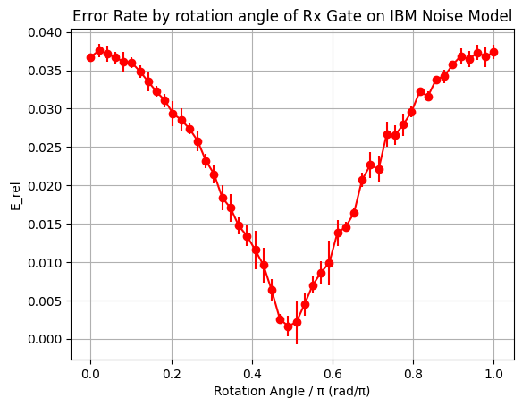

# Investigating Angle-Dependent Errors in Rzz and Rx Gates on IBM Quantum Hardware

**Author:** Rafe Whitehead  
**Date:** April 2025

---

## 1. Overview

This project aims to determine whether the error rates of IBM's `Rzz` and `Rx` gates vary significantly with their rotation angle. This is motivated by explorations into whether tuning the rotation angles of `Rzz` and `Rx` gates to low-error regions can improve the performance of the Quantum Approximation Optimization Algorithm (QAOA).

Simple circuits containing a single `Rzz` or `Rx` gate are evaluated using IBM hardware (for the `Rzz` gate) or IBM simulators loaded with noise models (for the `Rx` gate). This is done for a range of rotation angles and the measured results are compared to anticipated results to determine a measure of error.

For the `Rx` gate, evidence of a sinusodial relationship between rotation angle and error rate of the gate was found, with the error rate dropping over 95% from peak to trough. For the `Rzz` gate no trends were observed between the rotation angle and error rate of the gate. As the error contribution to QAOA from these gates is dominated by the `Rzz` gate contribution, improvements to the `Rx` gate would have negligible effect on the quality of the QAOA results. Further work could investigate whether this is also the case for other hardware devices or when including the effects of error suppression techniques, which are neglected here.

---

## 2. Background

The QAOA algorithm [\[1\]](#ref-1) is promising for the Noisy Intermediate Scale Quantum (NISQ) era of quantum computers due to its low required circuit depth and applicability to combinatorial optimisation problems [\[2\]](#ref-2). This algorithm optimises gate parameters in the quantum circuit by evaluating the circuit repeatedly within a classical optimiser. To reduce the number of optimisation evaluations required, work has been done to determine suitable initial parameters for the quantum circuit, for instance through bilinear strategy, TQA initialisation [\[3\]](#ref-3), or transfer learning [\[4\]](#ref-4). The parameter optimisations then search a subset of the search space near these initial parameters and achieve results with modest reduction in quality at far fewer optimisation evaluations [\[4\]](#ref-4).

The QAOA algorithm is implemented on gate based devices through a series of layers of `Rx` and `Rzz` gates [\[6\]](#ref-6), a 2-layer example of which can be seen in [Figure 1](#fig-1). As the number of layers increase the theoretical likelihood of a good result improves (each layer can be thought of as additional and diminishing extra term in a the adiabatic approximation). The parameters trained during the optimisation process, βn and γn for the nth layer, control the rotation angles of the gates in this layer as shown in [Figure 1](#fig-1).

**Figure 1:** Two layers of the IBM implemented QAOA circuit, showing the arrangement of `Rx` (single-qubit rotations) and `Rzz` gates (2-qubit entangling operations). Note that the `Rzz` gates consists of a 2-qubit `zz` interaction followed by two `Rz` gates.

Reducing the error rate of the `Rx` and `Rzz` gates would reduce the additional error contribution of each QAOA layer, improving the quality of results. If these gates have a relationship between their rotation angle and their error rate, this work proposes the error rate of the circuit could be reduced by constructing gates such that the angles of rotation given in the initialisation strategies (which are expected to be close to the final rotation angles used) lie within the low-error regions of the rotation angle space. This is illustrated in [Figure 2](#fig-0), where a illustrative gate error response to the rotation angle is offset to reduce the error rate at a gate rotation angle of 0.5π.

The physical interpretation of this rotation angle is not explored in this work. This could perhaps be implemented by altering the initial preparation state of the qubits or a global phase adjustment. It's possible these changes may introduce additional errors that make this adjustment non-worthwhile but work aims purely to establish the motivation for whether these methods should be explored further.

  
**Figure 2:** An example of potential gate error rate improvement at a specific rotation angle. Here, the gate has low rates of error at angle 0, but transfer learning suggests an initial rotation angle of 0.5π. Applying an offset of 0.5π reduces the error rate at 0.5π.

Hardware implementations use error suppression techniques to improve result quality, which may depend on the phase of the qubits (and therefore be dependent upon the gate rotation angles). Considering these error suppression techniques is beyond the scope of this initial project but could be explored in future work.

---

## 3. Methodology

### Hardware

For this investigation, freely available IBM hardware was chosen for its accessibility and strong QISKIT documentation [\[5\]](#ref-5). The device `ibm_brisbane` was chosen arbitrarily, as all devices offered under the free plan have identical specifications

Generally, in each layer of the QAOA algorithm, the gate error contribution is dominated by the 2-qubit `Rzz` gate, with IBM reporting an error rate two orders of magnitude higher for the `Rzz` gate as compared to the `Rx` gate for `ibm_brisbane` [\[7\]](#ref-7). In this investigation, these gates were probed independently for their relationship between error rate and angle of rotation. Due to the larger contribution of the `Rzz` gate to the overall QAOA circuit error, this gate was investigated using the limited free resources of the `ibm_brisbane` device. The `Rx` gate was investigated using only the IBM simulator provided in QISKIT, loaded with an `ibm_brisbane` noise model.

### Evaluation Metrics

This investigation focussed on how the error rates of the `Rz` and `Rx` gates vary with rotation angles, rather than their absolute values. Therefore, a simple metric was chosen to track this, named here as the relative error, Erel, given by

Erel = (Nmeasured - Nexpected) / Nexpected

which is found for each rotation angle and repeat number, where Nmeasured is the number of shots with a given output and Nexpected is the number of shots expected for that output. This metric is simple to calculate and allows for direct comparison across different rotation angles and output channels. Other metrics, such as the fidelity, can contain information about the distance between the produced and desired state, but in this initial investigation conducted with simple circuits this level of analysis is out of scope and the simple metric of Erel is sufficient.

<!-- tidy up below paras -->

As a 1-qubit circuit, the circuit used to investigate the `Rx` gate shown in [Figure 3](#fig-2) has two possible outcomes, `|0⟩` and `|1⟩`, meaning the output frequencies of the two channels are inversely related (any result not |0⟩ must be |1⟩). Therefore, this gate can be investigated by considering only the Erel of the `|1⟩` channel. However, the circuit used to investigate the `Rzz` gate has four possible outcomes, meaning considering only one potential output could obscure behaviour of different outcomes. Therefore, Erel is found for each potential output for the `Rzz` gate circuit.

Nexpected was found for the circuits used to investigate the `Rx` and `Rzz` gates by evaluating the theoretically predicted states for each rotation angle and circuit, the expressions of which are simple due to the simplicity of the circuits investigated. The mechanisms used to calculate Nexpected differ based on the circuit construction and are defined for the `Rx` and `Rzz` gates in the following section.

<!-- starting with a big old statement here - hell of an expectation? -->

<!-- Due to the periodic nature of the angle of rotation, any relationship found between the error rate and rotation angle is expected to have a periodic nature. Each graph is therefore fitted with a first order Fourier series approximation of the form -->

<!-- ref here would be great
<!-- rotation angle double here? -->
<!--
Erel = β0 ​+ β1​sin(θ) + β2​cos(θ)

using a least-squares regression to determine the coefficients of each term. The p-values of the β coefficients are then used to determine whether the inclusion of these terms aids the quality of this fit (using the p > 0.005 significance threshold). If neither the sin or cosine terms are found to provide statistically significant improvements to the fit quality, it is deemed that no relationship exists between the error rate and rotation angle. It is possible that this analysis neglects a relationship between the error rate and rotation angle that would be captured by higher order terms of the Fourier series, but this was deemed sufficient for the initial analysis. -->

### Experimental Setup

The `Rx` and `Rzz` gates were investigated using different circuits and experimental parameters, largely due to IBM's limited free device access. A summary of these parameters is given below, and further detail provided in the paragraphs following.

**Experimental Parameters:**

- `Rx` Gate:
  - Device: IBM simulator loaded with `ibm_brisbane` noise model
  - Circuit: [Figure 3](#fig-2)
  - Shots: 216, repeated 5 times
  - Angles: 50 equally spaced between 0 and π
- `Rzz` Gate:
  - Device: `ibm_brisbane`
  - Circuit: [Figure 4](#fig-3)
  - Shots: 216, 215, 215 (over 3 dates)
  - Angles: 20 equally spaced between 0 and 2π

For both gates, the simple circuits were used to minimise the evaluation time, corresponding to the circuits seen in [Figure 3](#fig-2) and [Figure 4](#fig-3). As the `Rx` was investigated using a simulator it was constrained only by the computing power of the local device used, whereas the `Rzz` gate investigation had to be conducted within the 20 minutes of free quantum processing time offered by IBM over the time period this work was carried out. For this reason, the `Rx` gate was investigated at more angles, more shots, and for more repeats than the `Rzz` gate.

When the `Rx` investigation circuit, given in [Figure 3](#fig-2) is evaluated with the input `|0⟩` and a rotation angle θ, the anticipated result, `|φ⟩`, is given by

|φ⟩ = cos(θ/2)|0⟩ - i sin(θ/2)|1⟩

meaning the likelihood of measuring |1⟩ from the final state is given by

P(1) = sin2(θ/2)

allowing the Nexpected metric to be calculated for each `Rx` gate rotation angle of θ using

Nexpected = Nshots \* sin2(θ/2)

As sin2(θ/2) is symmetrical over the ranges [-π, 0] and [0, π], a full 2π rotation angle can be investigated by considering only the range [0, π].

  
**Figure 3:** Circuit used to explore the error profile of the `Rx` gate.  

When the `Rzz` investigation circuit, given in [Figure 4](#fig-3) is evaluated with the input `|00⟩`, the anticipated result, `|φ⟩`, is an equal superposition between all possible output states, given by

|φ⟩ = (1/2) (|00⟩ + |01⟩ + |10⟩ + |11⟩)

meaning there is even likelihood of measuring any of the four possible output bit strings. Therefore, Nexpected is defined for each angle and possible outcome as

Nexpected = Nshots / 4

  
**Figure 4:** Circuit used to explore the error profile of the `Rzz` gate.  

---

## 4. Results

### Rx Gate

<!-- abs err constant means this relationship? investigate + think, what would this mean? -->

The results of the `Rx` gate investigation can be seen in [Figure 6](#fig-5) where the errors bars represent the standard deviation across three simulator initialisations.

  
**Figure 6:** Results of the `Rx` gate angle investigation, showing the relative error against the rotation angle. A clear sinusoidal relationship can be seen.

This investigation shows an observable sinusoidal relationship between the angle of rotation and the error rate of the gate. The `Rx` gate has its highest error rates at rotation angles of [0π, 1.0π] and lowest error rates at rotation angles near 0.5π. The error rate varies significantly, dropping by over 95% from approximately 0.0038 to 0.002. It is noted that this error rate far exceeds the reported `Rx` error value for `ibm_brisbane`, likely due to error mitigation techniques employed by the hardware which are not utilised here (the `Rx` gate investigation was conducted using an IBM simulator loaded with an `ibm_brisbane` noise model).

### Rzz Gate

The results of the `Rzz` gate investigation can be seen in [Figure 5](#fig-4), where the error bars represent the standard deviation across three device initializations on separate dates.

  
**Figure 5:** Results of the `Rzz` gate angle investigation, showing the relative error for each output channel. Each channel exhibits distinct behavior, but no strong relationship between rotation angle and error rate is observed.

The `Rzz` gate investigation revealed different behaviours for each output channel:

- Channels |01⟩ and |11⟩ were systematically detected more often than expected, indicating leakage into these channels.
- Channel |00⟩ was detected less often than expected, showing leakage out of this channel.
- Channel |10⟩ showed evidence of both under- and over-detection at different rotation angles.

<!-- implement a statistical test - do a fourier series fit maybe? -->

But no channel showed an observable relationship between the rotation angle and error rate. The lack of a clear relationship in [Figure 5](#fig-4) suggests that adjusting rotation angles is unlikely to significantly reduce overall error rates for the `Rzz` gate.

## 5. Conclusion

The `Rx` gate shows a strong sinusoidal dependence on rotation angle, but its contribution to QAOA error is negligible. In contrast, the `Rzz` gate shows no observable evidence of an angle-dependent error rate. Since QAOA gate errors are dominated by the `Rzz` gate, further investigations on IBM hardware are unlikely to offer result quality improvements. Future work could probe these relationships when changing hardware device or when including error mitigation techniques.

## References

1.  E. Farhi, J. Goldstone. "A Quantum Approximate Optimization Algorithm," 2014. [arXiv:1411.4028](https://arxiv.org/abs/1411.4028).
2.  L. Zhou et al. "Quantum Approximate Optimization Algorithm: Performance, Mechanism, and Implementation on Near-Term Devices," 2019. [arXiv:1812.01041](https://arxiv.org/pdf/1812.01041).
3.  X. Lee et al. "Parameters Fixing Strategy for Quantum Approximate Optimization Algorithm," 2021. [arXiv:2108.05288](https://arxiv.org/pdf/2108.05288).
4.  R. Shaydulin et al. "Parameter Transfer for Quantum Approximate Optimization of Weighted MaxCut," 2023. [arXiv:2201.11785](https://arxiv.org/pdf/2201.11785).
5.  IBM. QISKIT, accessed 2025. [Docs](https://docs.quantum.ibm.com/guides).
6.  IBM. QISKIT QAOA Documentation, accessed 2025. [Docs](https://docs.quantum.ibm.com/api/qiskit/qiskit.circuit.library.qaoa_ansatz).
7.  IBM. `ibm_brisbane` specifications, accessed 2025. [Link](https://quantum.ibm.com/services/resources?resourceType=current-instance&system=ibm_brisbane).
8.  IBM. Default hardware options, accessed 2025. [Link](https://docs.quantum.ibm.com/api/qiskit-ibm-runtime/sampler-v2).
<!-- 9.  N. Ezzel et al. "Dynamical decoupling for superconducting qubits: a performance survey", 2023. [arXiv:2207.03670](https://arxiv.org/pdf/2207.03670). -->

<!-- future improvements to this study:
  1. Statistical tests to look for evidence of angle-error relationships
  2. Better treatment of errors (not just std over 3 dates),
  3. Rel error of Rx gate is sinusoidal, but its just a const abs error
    (what does this mean?)
 -->
